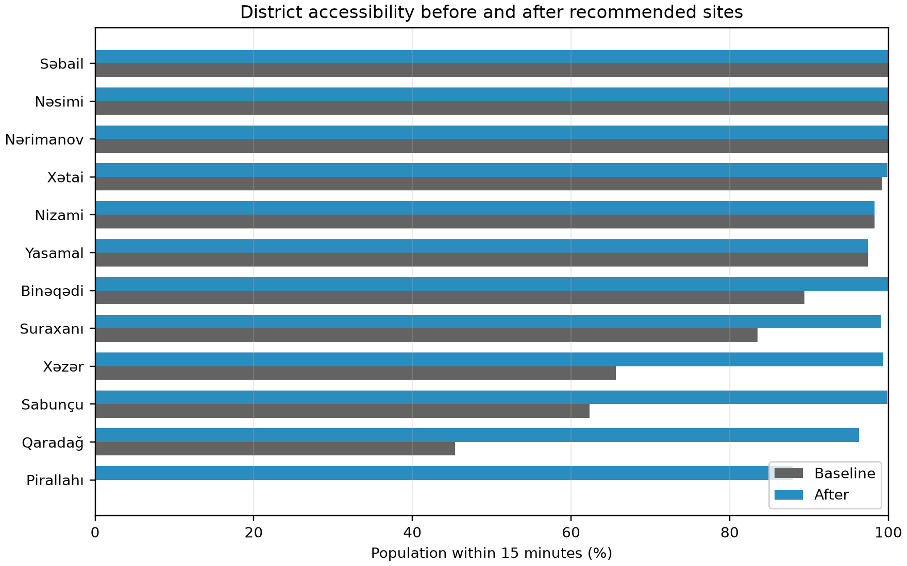
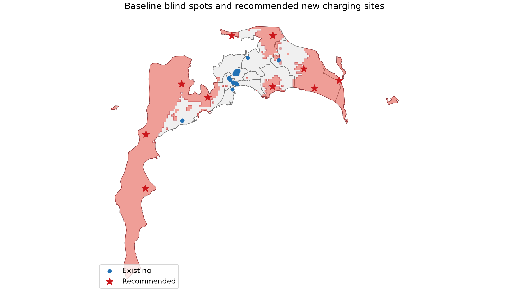
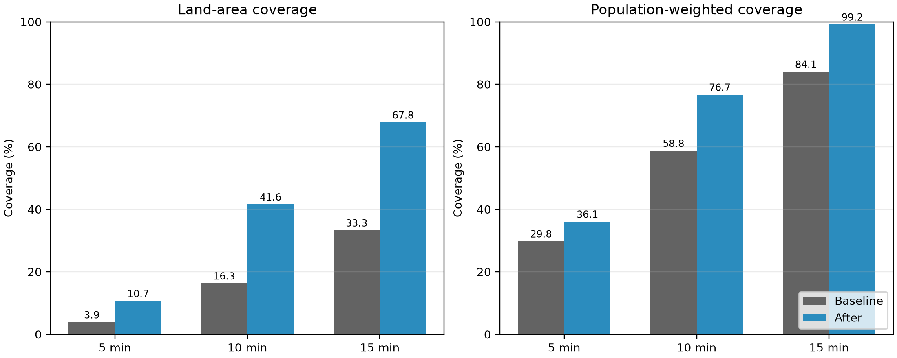
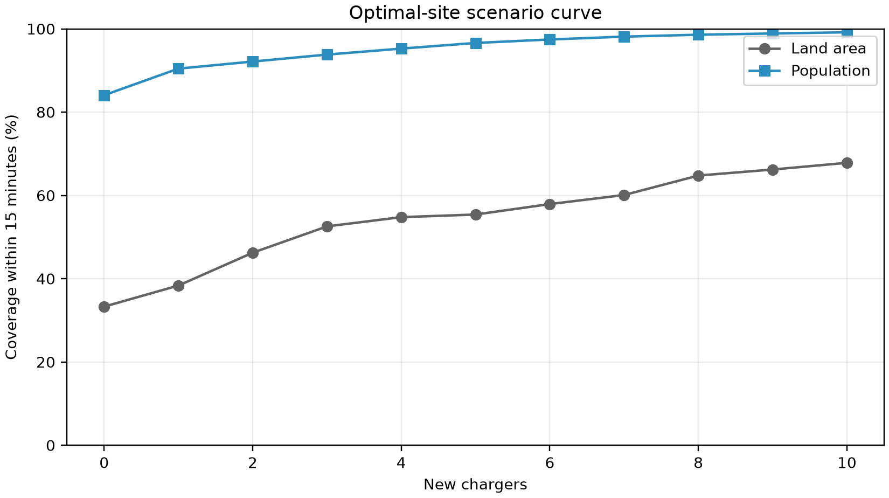

# Optimizing Public EV Charging Infrastructure in Baku

**Technical report — analysis snapshot 2026-07-12**

## Executive summary

This study measures directed driving-network accessibility from a land-clipped 750 m grid to an inclusive OpenStreetMap EV-charger inventory, then uses a population-weighted maximum-coverage model to select 10 new screening-feasible host sites. The study combines official Azerbaijan district polygons, OpenStreetMap roads/chargers/POIs, Natural Earth land, and WorldPop 2026.

- Baseline land coverage within 5/10/15 minutes: **3.9% / 16.3% / 33.3%**.
- After land coverage within 5/10/15 minutes: **10.7% / 41.6% / 67.8%**.
- Baseline population coverage within 5/10/15 minutes: **29.8% / 58.8% / 84.1%**.
- After population coverage within 5/10/15 minutes: **36.1% / 76.7% / 99.2%**.

Recommended coordinates are desktop planning shortlists, not construction approvals.

## 1. Study area and data

The study uses the 12 Baku district polygons from Azerbaijan's official IDDA Open Data Portal, clipped to Natural Earth land. Existing chargers and candidate POIs come from dated Overpass responses; the road graph is a directed OSMnx extraction. WorldPop 2026 constrained 100 m population is aggregated to grid cells. OSM station access is inclusive: explicit private/no sites are excluded, while missing access tags remain unknown.

## 2. Method

Each clipped grid fragment is represented by a point snapped to the nearest driveable OSM node. A reverse multi-source Dijkstra gives every origin's shortest directed time to a charger. Coverage is reported at 5, 10, and 15 minutes using both land area and WorldPop population as denominators. Candidate POIs near weighted K-means blind-spot clusters are evaluated with reverse cutoff Dijkstra. A binary SciPy/HiGHS model lexicographically maximizes population coverage at 15, then 10, then 5 minutes, subject to a 1500 m spacing rule.

## 3. District accessibility

| District | Existing sites | Baseline population ≤15 min | After population ≤15 min | Uplift |
|---|---:|---:|---:|---:|
| Pirallahı | 0 | 0.0% | 88.0% | +88.0 pp |
| Qaradağ | 1 | 45.4% | 96.3% | +50.9 pp |
| Sabunçu | 1 | 62.3% | 99.9% | +37.5 pp |
| Xəzər | 2 | 65.7% | 99.4% | +33.7 pp |
| Suraxanı | 0 | 83.5% | 99.0% | +15.5 pp |
| Binəqədi | 5 | 89.4% | 100.0% | +10.6 pp |
| Yasamal | 0 | 97.4% | 97.4% | +0.0 pp |
| Nizami | 0 | 98.2% | 98.2% | +0.0 pp |
| Xətai | 0 | 99.1% | 99.9% | +0.8 pp |
| Nərimanov | 1 | 100.0% | 100.0% | +0.0 pp |
| Nəsimi | 6 | 100.0% | 100.0% | +0.0 pp |
| Səbail | 2 | 100.0% | 100.0% | +0.0 pp |

## 4. Blind spots

| Zone | Primary district | Area (km²) | Mean excess over 15 min |
|---|---|---:|---:|
| BLIND-001 | Qaradağ | 892.4 | 12.0 |
| BLIND-002 | Xəzər | 249.0 | 10.2 |
| BLIND-003 | Sabunçu | 93.9 | 2.6 |
| BLIND-004 | Pirallahı | 10.0 | 15.0 |
| BLIND-005 | Pirallahı | 8.0 | 15.0 |
| BLIND-006 | Suraxanı | 39.1 | 2.6 |
| BLIND-007 | Binəqədi | 11.3 | 4.6 |
| BLIND-008 | Qaradağ | 2.5 | 15.0 |
| BLIND-009 | Xəzər | 1.1 | 15.0 |
| BLIND-010 | Qaradağ | 3.9 | 3.3 |

## 5. Recommended new charger locations

| Rank | Site | Type | District | Latitude | Longitude | Newly covered population ≤15 min |
|---:|---|---|---|---:|---:|---:|
| 1 | Parkinq | parking | Sabunçu | 40.554933 | 50.022826 | 153,314 |
| 2 | Parking | parking | Xəzər | 40.435062 | 50.170398 | 52,887 |
| 3 | Azpetrol | fuel_station | Qaradağ | 39.994466 | 49.430961 | 38,908 |
| 4 | Parking | parking | Suraxanı | 40.369462 | 50.024419 | 37,958 |
| 5 | Goradil Stansiyası | transport_station | Binəqədi | 40.552661 | 49.828083 | 35,883 |
| 6 | Gürgan İcra Nümayəndəliyi | townhall | Pirallahı | 40.394784 | 50.338884 | 26,629 |
| 7 | Parking | parking | Qaradağ | 40.327741 | 49.718090 | 18,072 |
| 8 | Parking | parking | Qaradağ | 40.190137 | 49.428645 | 13,574 |
| 9 | Parking | parking | Qaradağ | 40.374585 | 49.593097 | 12,240 |
| 10 | Oba Market | supermarket | Xəzər | 40.365333 | 50.223042 | 10,333 |

## 6. Accessibility improvement

All after-values are recomputed as the minimum time to any existing or selected site, preventing overlap double-counting. With 10 new sites, population coverage within 15 minutes changes by **+15.1 percentage points** and land coverage changes by **+34.5 points**.

## 7. Limitations

OSM stations may be incomplete, stale, duplicated, or missing access/connector/power metadata. Static OSM speeds do not measure Baku congestion. WorldPop is a modelled alpha population surface, not EV demand. Grid size and snapping introduce approximation. The optimization does not include uptime, queues, land tenure, electrical hosting capacity, costs, permits, safety, charging power, or connector compatibility. Each recommendation therefore requires operator verification and field, utility, commercial, and engineering review.

## 8. Sources and attribution

- [Azerbaijan IDDA Open Data Portal — Regions of Azerbaijan](https://opendata.az/en/@azerbaycan-respublikasinin-ekologiya-ve-tebii-servetler-nazirliyi/azerbaycanin-rayonlari)
- [OpenStreetMap copyright and ODbL](https://www.openstreetmap.org/copyright) — © OpenStreetMap contributors
- [WorldPop Azerbaijan 2026](https://hub.worldpop.org/geodata/summary?id=72400), DOI `10.5258/SOTON/WP00839`
- [Natural Earth](https://www.naturalearthdata.com/)
- [OSMnx documentation](https://osmnx.readthedocs.io/)
- [SciPy MILP documentation](https://docs.scipy.org/doc/scipy/reference/generated/scipy.optimize.milp.html)
